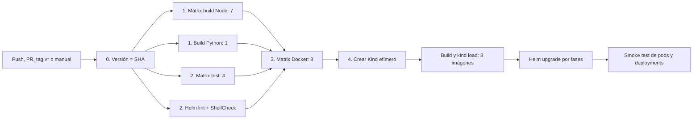
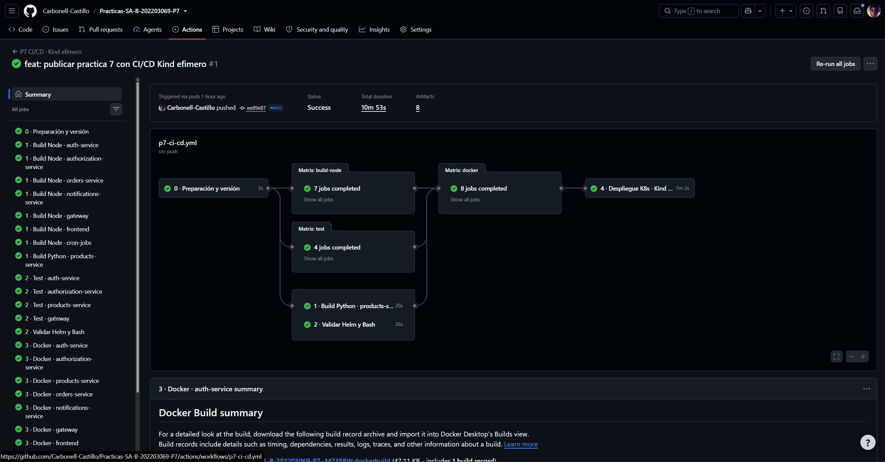
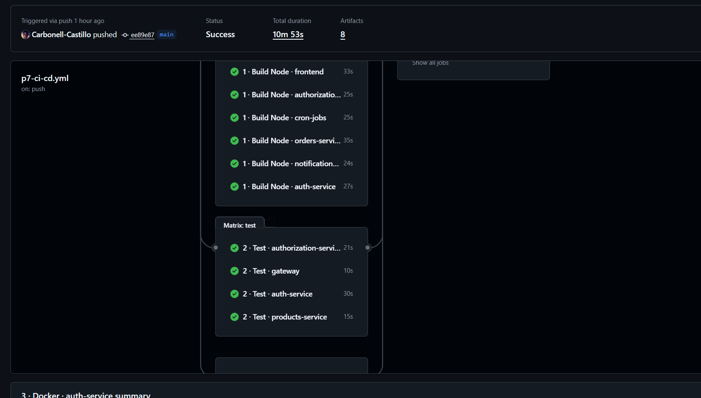
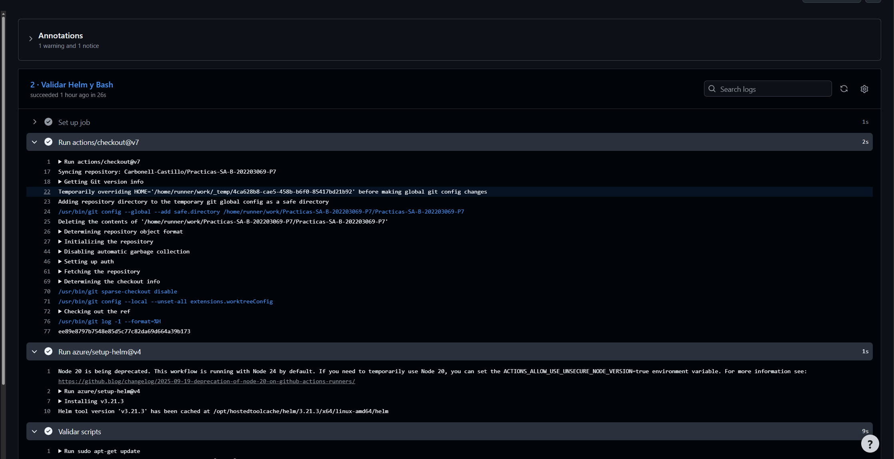
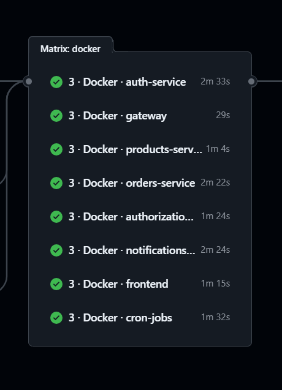
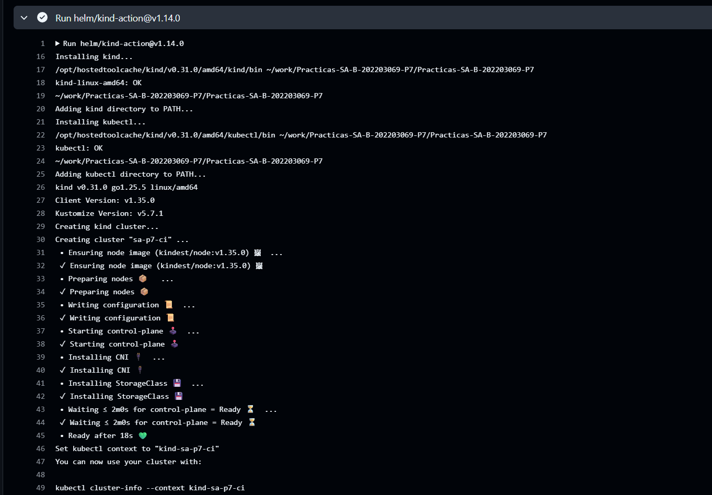
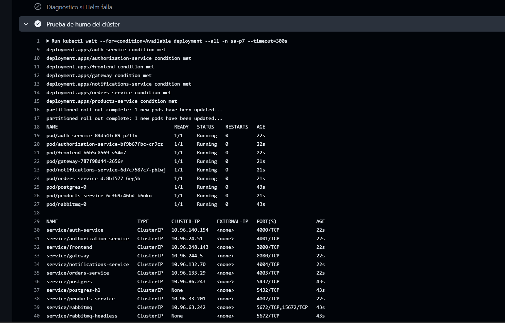
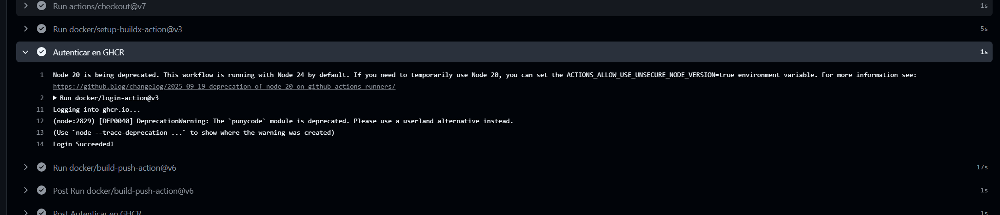
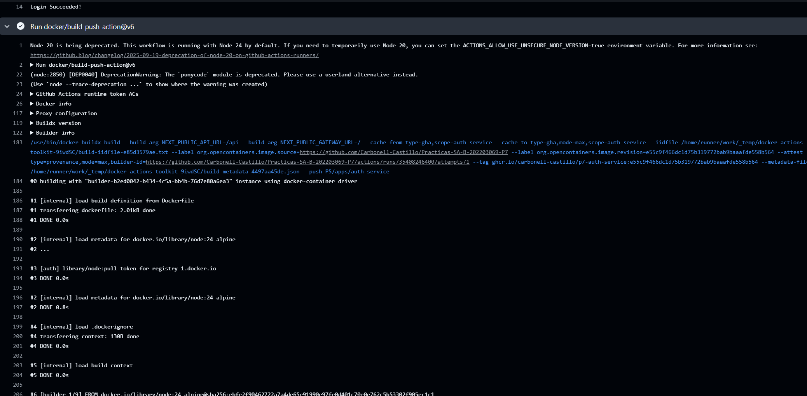

# Documentación técnica — Práctica 7

## Arquitectura



Todo ocurre en GitHub Actions. Kind ejecuta Kubernetes usando contenedores Docker dentro del runner Ubuntu; no es GKE ni un despliegue en nube. Cuando termina el job, GitHub elimina el runner y con él el clúster, las imágenes y los secretos generados.

## Disparadores

| Evento | Resultado |
| --- | --- |
| Pull request hacia `main` | CI completo y CD efímero en Kind |
| Push a `main` | CI completo y CD efímero en Kind |
| Tag `v*` | CI completo y CD efímero en Kind |
| `workflow_dispatch` | Ejecución manual completa |

Los filtros limitan ejecuciones a cambios en `P5/apps`, `P7` o el workflow.

## Etapas

### 0. Preparación y versión

Publica el SHA completo del commit como tag inmutable. El mismo identificador se usa en Docker y Helm, por lo que siempre puede conocerse qué código fue evaluado.

### 1. Build

La matriz Node ejecuta siete servicios en paralelo con Node 24 y `npm ci`. Auth genera Prisma antes de compilar; los servicios Nest/Next ejecutan su build y Gateway valida la sintaxis JavaScript. Products usa Python 3.12, instala dependencias y realiza un import de humo de FastAPI.

### 2. Pruebas y validación

- `auth-service`: prueba unitaria aislada de su controlador.
- `authorization-service`: health y reglas admin/client; se corrigió el spec obsoleto que aún llamaba a `getHello()`.
- `products-service`: compilación Python e import de la aplicación.
- `gateway`: validación de todos los archivos JavaScript.
- Helm: dependencias, lint y render completo con secretos ficticios.
- Bash: `bash -n` y ShellCheck sobre los scripts.

P5 contiene otros specs boilerplate sin mocks para Prisma, ConfigService o HttpService; no se presentan engañosamente como cobertura válida. Una mejora futura puede inyectar esos dobles de prueba y ampliar Jest.

### 3. Docker

Una matriz independiente construye los ocho Dockerfiles con Buildx. En `push`, tags `v*` y ejecuciones manuales, autentica contra GHCR con el `GITHUB_TOKEN` automático y publica ocho imágenes públicas con el formato `ghcr.io/carbonell-castillo/p7-<servicio>:<SHA>`. En pull requests construye las imágenes, pero no las publica. La caché de GitHub Actions está separada por servicio. En el job de CD, cada imagen host se elimina inmediatamente después de cargarla al nodo Kind para no duplicar varios GB en el disco limitado del runner.

### 4. CD en Kind

Después de todas las matrices, el job crea `sa-p7-ci`, reconstruye exactamente el mismo commit, etiqueta las imágenes como `sa-p7/<servicio>:<SHA>` y usa `kind load docker-image`. El perfil `values-kind.yaml` fija `pullPolicy: Never`, una réplica, persistencia desactivada y recursos pequeños.

Los secretos para Postgres, RabbitMQ, JWT y AES se generan aleatoriamente dentro de `$RUNNER_TEMP`; nunca se escriben en Git. Para evitar saturar el runner, Helm inicia primero Postgres y RabbitMQ y después despliega las aplicaciones. En CI se conservan los recursos hasta terminar el job si Helm falla, permitiendo imprimir pods, eventos y logs; Kind desaparece con el runner. Finalmente se exige que los siete deployments existan y que los nueve pods esperados (siete aplicaciones, Postgres y RabbitMQ) estén `Running/Ready`.

## Archivos

```text
.github/workflows/p7-ci-cd.yml       Pipeline
P7/scripts/build-service.sh          Build por tecnología
P7/scripts/test-service.sh           Pruebas automáticas
P7/scripts/helm-ci.sh                Validación del chart
P7/scripts/generate-helm-values.sh   Secretos efímeros
P7/scripts/deploy.sh                 Despliegue Helm por fases
P7/charts/sa-platform/values-kind.yaml Perfil Kind
P7/evidence/README.md                Lista de evidencias reales
```

## Prueba local opcional

Requiere Docker activo, Kind, Helm, kubectl, Node 24, Python 3.12 y Bash:

```bash
bash P7/scripts/build-service.sh auth-service
bash P7/scripts/test-service.sh authorization-service
bash P7/scripts/helm-ci.sh
```

La fuente de verdad evaluable es la ejecución remota de GitHub Actions, porque reproduce un runner limpio.

## Evidencia

Ejecuciones verificadas: [pipeline completo](https://github.com/Carbonell-Castillo/Practicas-SA-B-202203069-P7/actions/runs/35400491476) y [publicación en GHCR](https://github.com/Carbonell-Castillo/Practicas-SA-B-202203069-P7/actions/runs/35408246400).

### Pipeline completo



### Pruebas automáticas



### Validación de Helm y Bash



### Construcción de imágenes Docker



### Creación del clúster Kind



### Prueba de humo



### Publicación en GHCR





## Respuestas teóricas

**¿Qué es CI?** Es integrar cambios frecuentemente y verificarlos de forma automática. Aquí incluye builds, tests, sintaxis, Helm y Docker.

**¿Qué es CD en esta práctica?** Es entregar el artefacto validado a Kubernetes. El entorno es Kind efímero, por lo que demuestra la automatización y el estado saludable sin publicar una aplicación permanente.

**¿Por qué usar matrices?** Cada servicio falla y se diagnostica de forma independiente; además, GitHub puede ejecutar trabajos en paralelo y reducir el tiempo total.

**¿Por qué usar el SHA como versión?** Es inmutable y enlaza código, imagen y release. `latest` puede cambiar y no ofrece trazabilidad.

**¿Qué ocurre si algo falla?** GitHub no habilita los jobs dependientes. Si el fallo ocurre durante el despliegue Kind, la ejecución queda roja y el workflow imprime pods, eventos y logs para facilitar el diagnóstico. Los recursos se conservan hasta que termina el job y luego desaparecen junto con el runner efímero.

**¿Kind equivale a producción?** No. Ejecuta una API Kubernetes real y es ideal para verificar manifests y despliegues en CI, pero no modela balanceadores, discos ni alta disponibilidad de un clúster administrado.

**¿Por qué no se requieren secretos configurados manualmente?** GHCR utiliza el `GITHUB_TOKEN` temporal que GitHub Actions entrega automáticamente al workflow con permiso `packages: write`. Las credenciales internas de Postgres, RabbitMQ, JWT y AES se generan durante el job, viven en `$RUNNER_TEMP` y se eliminan con el runner.
